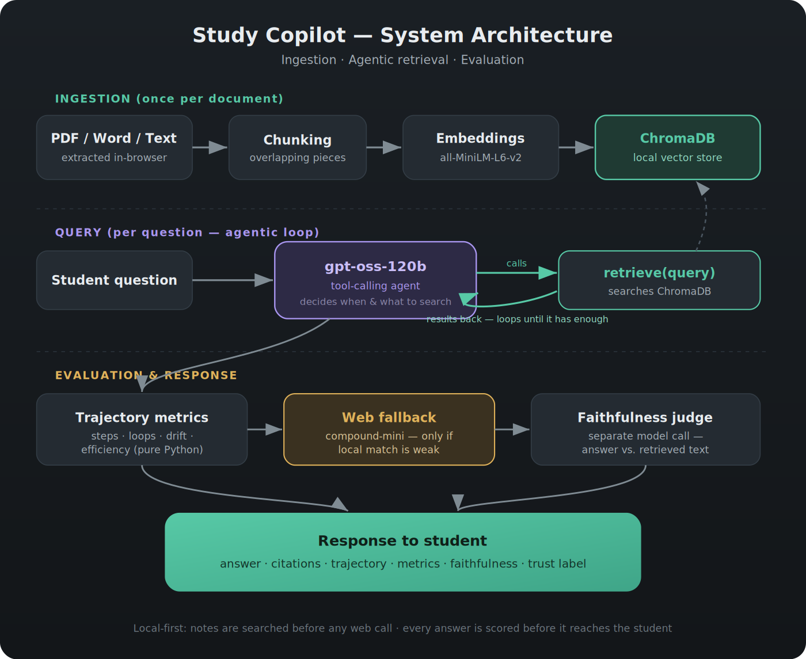

# Study Copilot

An AI study assistant that answers questions from a student's own uploaded notes, and reports how much each answer can be trusted.

Built for **Problem Statement 2 — AI for Equitable Education Access** (Grounded Doubt-Solving Agent track).

The idea is simple: a student without a tutor uploads their notes, asks questions, and gets answers grounded in their own material — with citations, and an honest signal about when an answer might be wrong. The part I spent the most effort on isn't the chatbot; it's the evaluation layer that sits on top of it and tells you *whether to believe the answer*.

## Why this instead of a normal chatbot

A plain chatbot is a bad fit for a student who has no teacher to check its work:

- It answers from generic training knowledge that may not match their syllabus.
- It hallucinates confidently, and the student can't catch it.
- It never tells you when an answer is shaky.

Study Copilot answers from the student's *own* notes, cites where each claim came from, and runs its answers through a separate evaluation pass so the student knows when to double-check.

## What it does

- Upload notes as PDF, Word, or plain text — extracted, chunked, and embedded automatically.
- Answers questions using agentic retrieval: the model decides on its own whether to search, what to search for, and how many times, rather than doing one fixed lookup.
- Scores the *search process* separately from the *answer* — so you can tell a bad-retrieval failure apart from a hallucination.
- Cites the exact source passage for every answer.
- Falls back to web search only when the notes genuinely don't cover the question, and says so, with sources.
- Adapts explanation depth (beginner / standard / advanced).
- Remembers recent turns so follow-up questions work.
- Shows a plain-language trust label and a prompt-improvement tip on every answer.
- Tracks per-session study metrics (topics revisited, notes-vs-web ratio, self-rated understanding).

## The core idea: evaluate the search, not just the answer

Most RAG systems only ask "was the final answer correct?" That can't tell you *why* an answer was bad. This project measures two things independently:

- **Retrieval quality** — from the search trajectory: how many searches it took, whether any were wasted, whether it looped, and whether it drifted off the original question.
- **Faithfulness** — a separate model call that checks whether the answer is actually supported by what was retrieved, catching hallucination even when retrieval worked.

Keeping these apart means a weak answer can be traced to its cause: the system either never found the right material (retrieval), or found it and didn't use it honestly (generation). For a student who can't independently verify, knowing *when* to double-check is the whole point.

## Architecture



## Stack

- FastAPI backend
- `sentence-transformers` (`all-MiniLM-L6-v2`) for embeddings — runs locally, no cost
- ChromaDB for vector storage — local and persistent
- Groq API: `openai/gpt-oss-120b` for retrieval and the faithfulness judge, `groq/compound-mini` for the web fallback
- Single-file HTML/JS frontend, no build step

## Files

```
main.py                 backend: ingestion, agentic retrieval, evaluation
study_copilot_ui.html   frontend
requirements.txt        dependencies
.env.example            template for the API key
.gitignore
```

## Running it locally

Requires Python 3.10+ and a Groq API key (free at console.groq.com).

```bash
# 1. clone and enter
git clone <your-repo-url>
cd <repo-folder>

# 2. virtual environment
python -m venv venv
venv\Scripts\Activate.ps1        # Windows
# source venv/bin/activate       # macOS / Linux

# 3. dependencies
pip install -r requirements.txt

# 4. API key (same terminal you run the server in)
$env:API_KEY = "your_groq_api_key"     # Windows
# export API_KEY="your_groq_api_key"   # macOS / Linux

# 5. run
uvicorn main:app
```

Wait for `Application startup complete`, then open `study_copilot_ui.html` in a browser. It talks to the backend on `http://localhost:8000` — no separate web server needed.

The first run downloads the embedding model (~80 MB) once and caches it.

### Using it

In the Ask tab, upload your notes and click "Add to your notes". Ask a question, pick a difficulty, and expand the "Why you can trust this" panel on any answer to see the search trajectory, metrics, and faithfulness score. The Student Metrics tab aggregates your session.

## The metrics, and how each is calculated

All the trajectory metrics are computed in plain Python from the logged search steps — no extra model calls, so they cost nothing. Each search step records the query used, the chunk IDs returned, and the best (lowest) similarity distance.

- **Steps** — a simple count of how many times the agent called `retrieve()`. High counts hint the notes are thin on that topic.

- **Unnecessary steps** — counts steps (after the first) whose returned chunk IDs were all already seen in an earlier step. A step that surfaces no new chunk is wasted effort.

- **Loop detected** — for each search, the query's embedding is compared (cosine similarity) against every earlier step's query embedding. If any pair exceeds 0.95, the agent is flagged as looping — re-asking almost the same thing without progress.

- **Drift** — each step's query embedding is compared to the *original question's* embedding. `drift = (similarity at first step) − (similarity at last step)`. Positive means it wandered off; ≤ 0 means it stayed locked on (or tightened toward) the original question.

- **Avg distance** — the mean of each step's best retrieval distance (from ChromaDB). Lower means the notes closely matched the query; high values flag a weak spot in the notes and are what can trigger the web fallback.

- **Efficiency** — a single 0–1 summary: `1 / (1 + unnecessary_steps + 2·loop_penalty)`. A clean search with no waste and no loops scores 1.0.

- **Faithfulness (0–10)** — the one metric that uses a model: a separate LLM call is given the final answer and the actual retrieved text, and asked to score how well every claim is supported. This is independent of the trajectory metrics, so a bad answer can be traced to either retrieval (trajectory) or generation (faithfulness).

## Known limitations

- Faithfulness is scored by an LLM judge, not validated against human ratings — standard practice (see RAGAS) but not perfect.
- There's no labelled test set yet, so the metrics measure search *behaviour*, not correctness against a known answer key.
- Student metrics are stored per-browser, with no accounts.
- The efficiency score penalises waste, not step count — a clean 3-step search scores the same as a clean 1-step one.

## Possible next steps

Ordered roughly by priority — the first few make the current system provable, the rest extend it.

**Make it measurable**
- Build a small labelled test set (questions tagged with the chunks that should be retrieved and a known-good answer) to compute real precision/recall instead of only behavioural metrics.
- Validate the faithfulness judge against hand-scored answers, to confirm the LLM-as-judge actually agrees with human judgement.
- Use that test set to tune the web-fallback threshold, which is currently a hardcoded guess.

**Improve retrieval quality**
- Sentence/paragraph-aware chunking instead of fixed character slicing, measured before/after on the test set.
- Make the efficiency score account for step count, not just wasted steps.
- Experiment with fine-tuning the embedding model on domain-specific material.

**Extend the product**
- User accounts so notes and metrics persist across sessions and devices.
- A teacher-facing view aggregating which topics a whole class struggles with.
- Deploy it as a hosted service (client-server ChromaDB + hosted backend) for a live link.

## Scalability

The design scales along a few axes without a rewrite:

- **Cost stays flat as usage grows** — embeddings run locally via `sentence-transformers`, so indexing more documents adds no API cost; only the generation and faithfulness calls hit an API.
- **Storage scales independently of the model** — ChromaDB can move from local persistent mode to client-server mode, letting many users or services share one vector store.
- **The API is stateless per request** (aside from short in-memory chat history), so the FastAPI backend can be horizontally replicated behind a load balancer.
- **Indexing is a one-time cost per document** — querying an already-indexed knowledge base stays fast and cheap regardless of how large the base grows, since only the top-k relevant chunks are ever retrieved.

## Security

The API key is read from an environment variable, never hard-coded. `.gitignore` keeps the virtual environment, the vector store, and any `.env` file out of the repo. If a key is ever committed, revoke it at console.groq.com — git history keeps old commits.

## Troubleshooting

**`Invalid API Key` (401) from Groq**
The `API_KEY` environment variable isn't set in the terminal running the server. Set it (`$env:API_KEY = "..."` on Windows, `export API_KEY="..."` on macOS/Linux) *before* starting `uvicorn`. It only lasts for that terminal session, so a fresh terminal needs it set again. Confirm with `echo $env:API_KEY`.

**`Connection refused` when the browser calls the API**
The backend isn't running, or isn't finished starting. Make sure `uvicorn main:app` is running in a terminal and has printed `Application startup complete` before using the UI. The first run also downloads the embedding model (~80 MB), so give it a moment.

**`model ... does not exist or you do not have access`**
The model name is unavailable on your Groq account/tier. Check the current model IDs at console.groq.com and update `MODEL` / `WEB_MODEL` in `main.py` if a model has been deprecated.

**`does not support citations` / unsupported parameter (400)**
Some Groq models don't accept every request field. Remove the unsupported field from the payload for that model.

**Rate limit (429), "tokens per minute exceeded"**
The free tier has a per-minute token cap. The backend already retries automatically after the wait Groq specifies. If you hit it often while testing, space out requests or lower `MAX_HISTORY_TURNS` in `main.py`.

**`Unprocessable Content` / JSON decode error on upload**
The request body wasn't valid JSON — usually from hand-typing JSON with unescaped characters. Use the UI (it builds the request correctly) rather than pasting raw JSON into a tool by hand.

**CORS / "Failed to fetch" in the browser**
The frontend and backend are different origins, so the backend must allow cross-origin requests. This is already enabled via `CORSMiddleware` in `main.py`; if you removed it, add it back.

**`UnicodeEncodeError` when printing responses in a Windows terminal**
The terminal's default encoding can't display some characters. This only affects console printing, not the app itself; set the terminal to UTF-8 (`chcp 65001`) or view output in the UI.

**Empty or irrelevant answers**
The collection may be empty — upload notes via the UI before asking. If answers are weak, the notes may simply not cover that topic (a high `avg distance` in the trust panel confirms this), in which case the web fallback takes over.

## Demo video

[link]

## Team

Mithiran A/
Surya Sanjeev/
G Sai Anirudh

